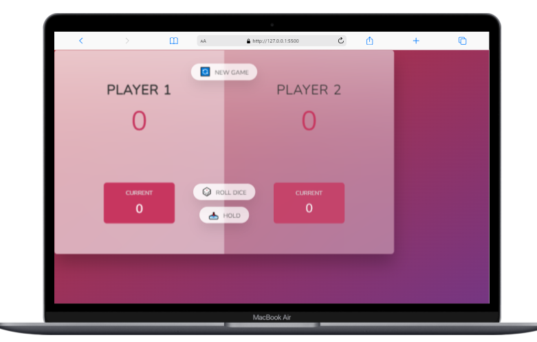

### Big-game

<!-- Feel Free to Add, Update, Delete Any Section you find needs so -->

#Big game 🎲

> .This project is Big game website, This game is with two player the first player Roll dice till then the next player and if the Roll dice is 1 the player lose his score and switch to the next player and who score 100 the winner 🎉 .

## Built With

- Languages: _**HTML, CSS, JavaScript**_
- Frameworks: _**N/A**_
- Technologies used: _**GIT, GITHUB, LINTERS**_

## Authors

<!-- Only Change Username for Different Accounts -->

👤 **Reem**

 Platform | Badge |
 --- | --- |
 **GitHub**  | [@Reem-lab](https://github.com/Reem-lab)
 **Twitter** | [Rem79940127](https://twitter.com/Rem79940127)
 **LinkdIn** | [reem-janina](https://www.linkedin.com/in/reem-janina-ab74ab21a/)

## 🤝 Contributing

Contributions, issues, and feature requests are welcome!

Feel free to check the [issues page](https://github.com/MrRamoun/WEBDEV/issues).

## Show your support

Give a ⭐️ if you like this project!

## Acknowledgments

- The Original design idea by [JonasSchmedtman](https://github.com/jonasschmedtmann) .
- Hat tip to anyone whose code was used
- Inspiration
- etc

